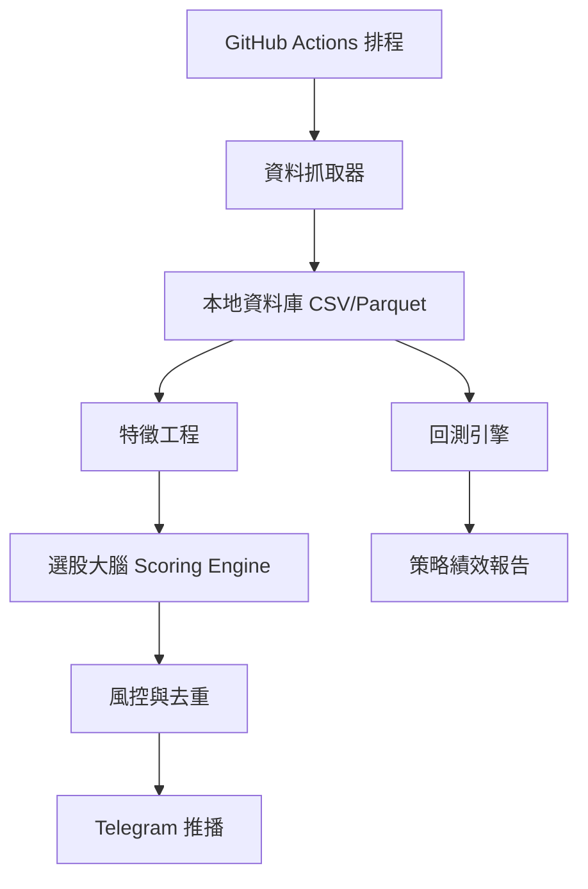

# 全免費台股 AI 選股與 Telegram 推播系統設計

作者：**Manus AI**

本文設計一套以「**全免費、可雲端自動運行、可擴充、可交給 Claude Code 逐步完成**」為核心的台股選股工具。系統目標不是保證一定選到飆股，而是建立一個可長期迭代的量化選股與事件監控框架，將技術面、籌碼面、基本面、新聞事件與回測整合成一個可解釋的「選股大腦」。

> 重要聲明：本系統只做資料整理、模型評分與提醒，**不是投資建議，也不保證獲利**。此外，「不被擋」在技術上不能保證百分之百，合理的做法是使用官方公開資料、低頻請求、快取、重試、備援與異常降級，將被阻擋與系統崩潰風險降到最低。

## 一、我建議的總體方向

最適合你現在需求的方案，是先用 **GitHub Actions + Python + Telegram Bot + GitHub Repository 儲存資料**。這個組合的優點是電腦關掉後仍可依排程執行，且公開儲存庫的標準 GitHub-hosted runners 可免費使用；GitHub Actions 也支援用 cron 排程觸發工作流程，因此可以做早報、晚報與盤中輪詢。[1] [2]

| 模組 | 免費方案 | 作用 | 風險與限制 | 設計對策 |
|---|---|---|---|---|
| 雲端執行 | GitHub Actions | 關機後仍排程執行 | 排程可能延遲，不適合秒級交易 | 盤中每 10 至 15 分鐘低頻輪詢 |
| 行情資料 | TWSE OpenAPI、TPEX OpenAPI、Yahoo/yfinance 備援 | 日成交、估值、融資融券、基本資料 | 免費資料可能延遲或欄位變動 | 官方優先、快取、欄位容錯 |
| 推播 | Telegram Bot API | 早報、晚報、盤中候選股 | Token 外洩風險 | 用 GitHub Secrets 保存 |
| 回測 | 本機 CSV/Parquet | 驗證策略有效性 | 初期資料不足 | 每日累積資料，另可匯入歷史資料 |
| 大腦 | 規則評分 + 權重 + 風控過濾 | 產生 Top N 候選股 | 過度擬合、追高風險 | 每次輸出理由與分數拆解 |

## 二、主架構

系統分為六層。第一層是資料層，負責抓取官方與備援資料。第二層是資料倉儲層，將每天抓到的資料存成 CSV 或 Parquet。第三層是特徵層，把股價、成交量、籌碼、估值、營收與事件轉成可比較的指標。第四層是選股大腦，依照策略規則產生分數。第五層是回測層，用歷史資料驗證策略。第六層是推播層，依不同時段輸出 Telegram 報告。



## 三、資料來源設計

臺灣證券交易所提供官方 OpenAPI，Base URL 為 `https://openapi.twse.com.tw/v1`，可取得上市個股日成交資訊、上市個股本益比/殖利率/股價淨值比、融資融券餘額、上市公司重大訊息、上市公司基本資料與月營收彙總等資料。[3] 櫃買中心也提供 TPEx OpenAPI，可作為上櫃與興櫃資料來源。[4]

| 面向 | 優先資料源 | 代表資料 | 用途 |
|---|---|---|---|
| 技術面 | TWSE/TPEX 日成交資料、累積歷史 CSV | 收盤價、成交量、漲跌幅 | 均線、量能、突破、RSI |
| 籌碼面 | TWSE 融資融券、法人買賣超資料 | 融資變化、券資比、外資買賣超 | 判斷籌碼穩定度 |
| 基本面 | 月營收、公司基本資料、估值資料 | 月營收年增率、本益比、殖利率 | 過濾體質與估值 |
| 新聞事件 | 每日重大訊息、可選 RSS/新聞摘要 | 法說、處分、公告、營收 | 事件加減分與風險提示 |
| 回測 | 每日累積資料、可匯入外部歷史資料 | OHLCV、特徵、分數 | 驗證策略勝率與回撤 |

## 四、選股大腦設計

核心大腦採用 **多因子加權評分**，先用硬性條件排除風險，再用分數排序。這種方式的好處是可解釋、容易調整，也適合你日後把新想法丟給我，我再轉成新的程式規則。

| 大腦區塊 | 權重 | 判斷邏輯 | 設計目的 |
|---|---:|---|---|
| 動能分數 | 30% | 短期漲幅、收盤價突破均線、相對強勢 | 找出資金正在進入的股票 |
| 量能分數 | 20% | 今日量大於 5 日或 20 日均量、量價同步 | 避免無量假突破 |
| 籌碼分數 | 20% | 融資不過熱、法人或主力趨勢偏多 | 降低追高後被倒貨風險 |
| 基本面分數 | 15% | 月營收成長、估值不極端、產業分類 | 避開體質過差股票 |
| 事件分數 | 10% | 重大訊息、新聞關鍵字、法說會題材 | 捕捉催化事件 |
| 風控分數 | 5% | 股價過低、流動性不足、異常波動扣分 | 避免地雷與流動性風險 |

「飆股候選」不應該只看漲幅，而要看 **動能、量能、籌碼、題材與風險是否同時對齊**。因此系統會輸出每檔股票的總分、分數拆解、觸發理由與風險提醒，而不是只丟股票代號。

## 五、推播節奏

早報負責整理開盤前觀察名單，晚報負責整理收盤後策略表現與隔日候選股，盤中提醒則只推播分數突然升高、量價突破或事件觸發的股票。為避免洗版與 API 請求過度，盤中預設每 10 至 15 分鐘檢查一次，同一檔股票在短時間內不重複推播。

| 時段 | 建議時間 | 推播內容 | 頻率 |
|---|---|---|---|
| 早報 | 台灣時間 08:30 | 昨日收盤後更新的候選股、今日觀察清單、風險提醒 | 每日一次 |
| 盤中 | 台灣時間 09:05 至 13:25 | 突破、放量、分數升高、事件觸發 | 每 10 至 15 分鐘 |
| 晚報 | 台灣時間 17:30 | 今日 Top 股、策略命中狀況、隔日觀察清單 | 每日一次 |

## 六、全免費部署路線

第一階段使用 GitHub Actions 是最簡單的免費方案。你只要建立 GitHub 帳號、建立公開 Repository，把程式碼放上去，再把 Telegram Bot Token 與 Chat ID 存到 GitHub Secrets，即可讓雲端排程執行。GitHub Actions 的排程使用 UTC，所以台灣時間要扣 8 小時，例如台灣 08:30 對應 UTC 00:30。[1]

第二階段若你未來希望更接近即時、想要網頁儀表板、資料庫或更穩定的常駐服務，可以再評估 Oracle Cloud Always Free、Google Cloud 免費額度或其他免費 VPS；但免費雲端主機通常有資格、信用卡、資源與停權政策限制，不能承諾永久免費或永不失效。

## 七、與 Claude Code 的搭配方式

你之後可以把你的策略想法丟給我，例如「我想找外資連買三天、今天爆量突破 20 日線、月營收年增率大於 20% 的股票」，我會幫你轉成明確需求、修改規則與可直接貼到 Claude Code 的指令。你在 Claude Code 只要貼上我整理好的區塊，就能讓它修改專案。

```text
請你在這個 Python 專案中新增一個台股選股規則：
1. 外資連續買超至少 3 天。
2. 今日成交量大於 20 日均量 2 倍。
3. 收盤價突破 20 日均線。
4. 月營收年增率大於 20%。
請修改 src/brain.py 與 src/indicators.py，保留原本架構，新增可測試函式，並在 README 補上規則說明。
```

## 八、下一步

本資料夾已附上可啟動的 Python 程式骨架。你接下來要做的事情是：建立 Telegram Bot、取得 Token 與 Chat ID、建立 GitHub Repository、設定 GitHub Secrets、把整個資料夾推上 GitHub。等你要開始實作時，我可以再幫你產生「從零建立 Repository 到自動推播」的一鍵複製命令。

## References

[1]: https://docs.github.com/actions/using-workflows/events-that-trigger-workflows "GitHub Docs：Events that trigger workflows"
[2]: https://docs.github.com/billing/managing-billing-for-github-actions/about-billing-for-github-actions "GitHub Docs：About billing for GitHub Actions"
[3]: https://openapi.twse.com.tw/ "臺灣證券交易所 OpenAPI"
[4]: https://www.tpex.org.tw/openapi/ "證券櫃檯買賣中心 OpenAPI"
